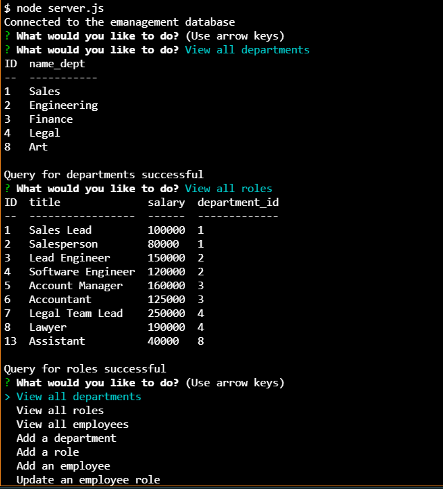
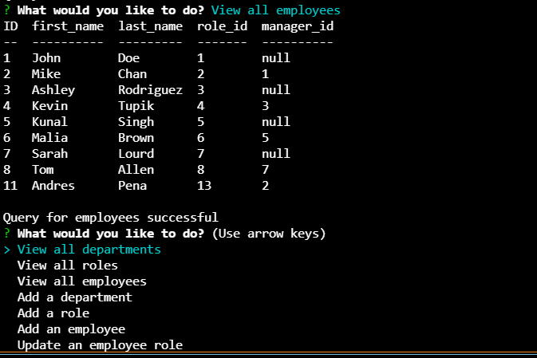

# <Employee-Management-System>

## Description

This Node.js application is run from the command-line. It will allow the user to view the Department, Roles and Employees tables, as well as add new data to them (new department, new role and/or new employee), based on user input. 

Database manipulation is necessary to gain knowledge and make informed decisions. A system to easily and intuitively read, create or update data regarding the company departments, roles and employees will allow the manager to allocate resources effectively and make better decisions.

This application will help me practice promises, template literals, sql, mySQL, inquirer and Express Js.

## Table of Contents
- [<Employee-Management-System>](#employee-management-system)
  - [Description](#description)
  - [Table of Contents](#table-of-contents)
  - [Installation](#installation)
  - [Usage](#usage)
  - [Credits](#credits)
  - [GitHub](#github)
  - [Features](#features)

## Installation

Go to the GitHub repo,
Fork the repo,
Open the CLI,
Follow the instructions on the #Usage section of this README.

## Usage

This application is run from the command line.
It is initialized using command node server.js.
a series of prompts will follow, asking for your input.
Answer accordingly and see the results in the command-line-terminal console.

For more usage instructions, check this [walkthrough video](https://watch.screencastify.com/v/wLdW3NrcIFpiHrYB1Yv3)

## Credits

- [Node.js](https://nodejs.dev/learn)
- [File System](https://nodejs.org/api/fs.html)
- [npm](https://www.npmjs.com/)
- [Inquirer](https://www.npmjs.com/package/inquirer)
- [Express](https://expressjs.com/)
- [mySQL2-npm](https://www.npmjs.com/package/mysql2#using-promise-wrapper)
- [console.table-npm](https://www.npmjs.com/package/console.table)
- [MySQL](https://www.mysql.com/)
- [MySQL documentation](https://dev.mysql.com/doc/)

## GitHub

To learn more, feel free to visit the [repo!](https://github.com/aj-pena/Employee-management.git)

## Features

- Express
- Node.js 
- File System 
- npm 
- Inquirer 
- MySQL
